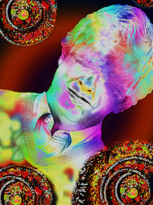

# The Shepherd

**The rainbow mind machine shepherd. [credit](credits.md)**

The Shepherd is a very simple object.
The Shepherd is essentially a data 
container for storing Sheep. When 
the flock is started, the Shepherd
will initialize each Sheep with its 
appropriate key file, and will then 
let the Sheep go off and do their thing.

